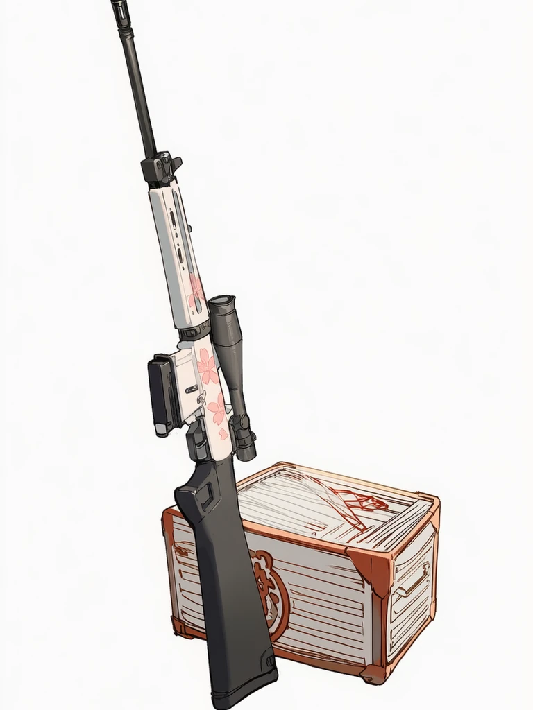
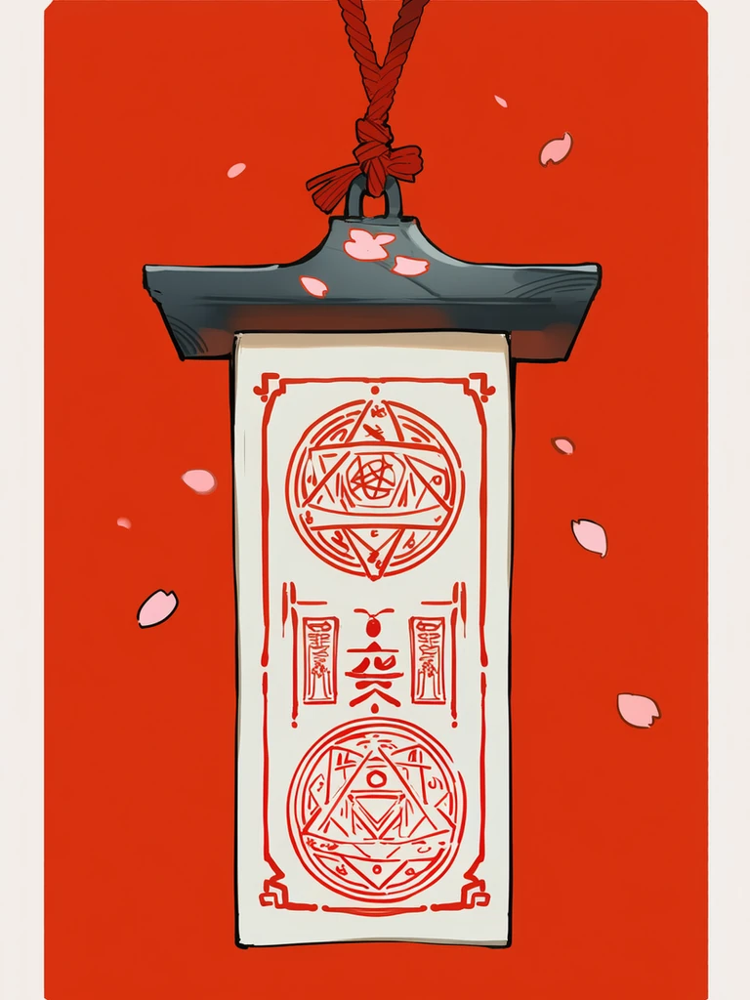
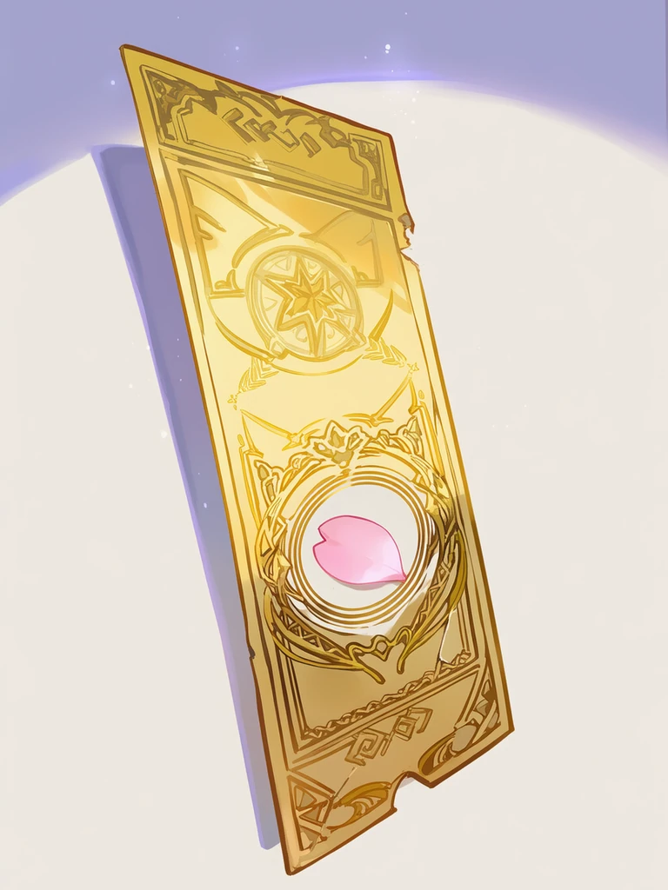
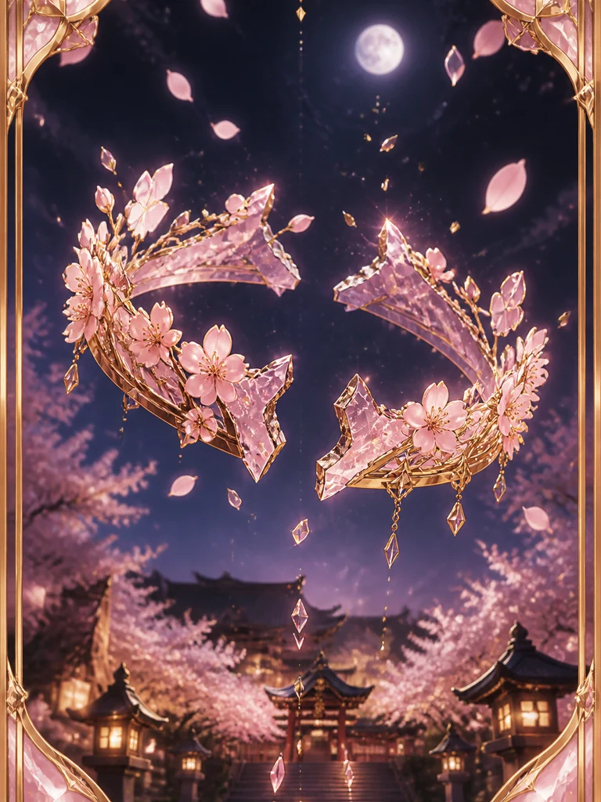
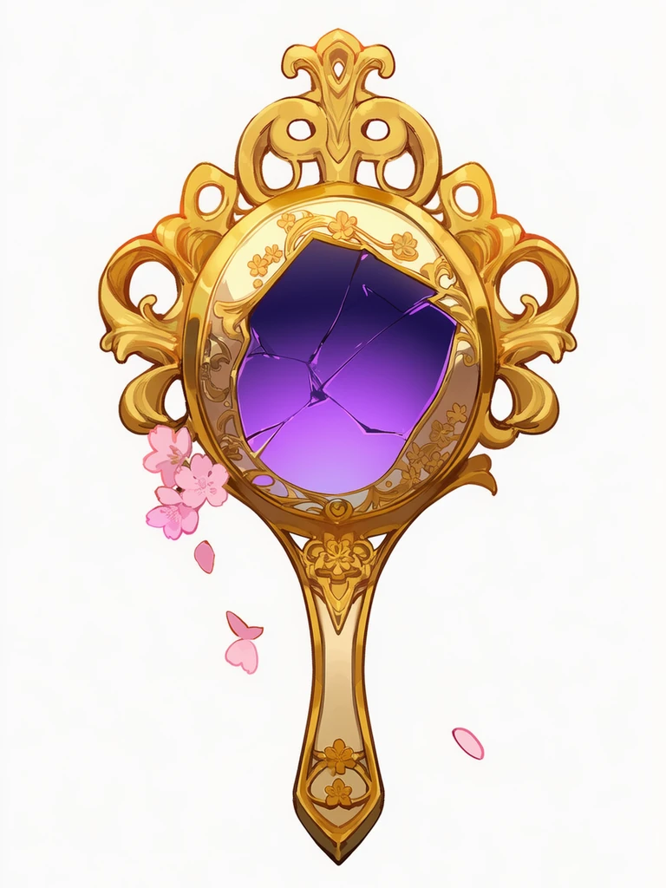
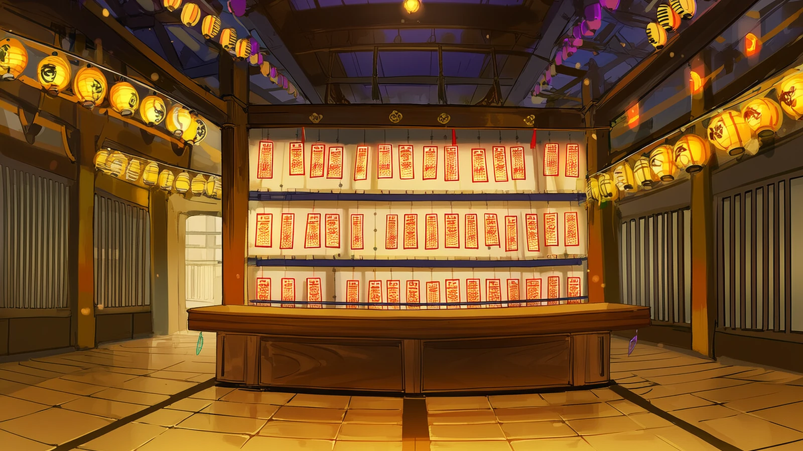
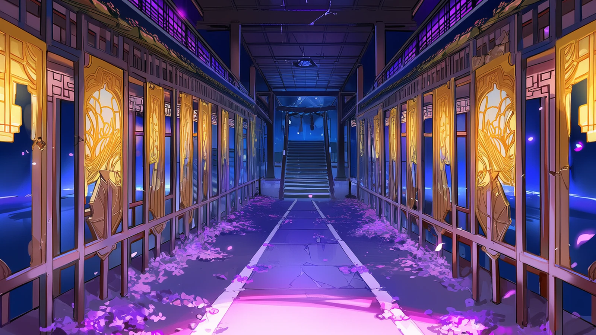

# NAI 出图预览

这些图已经进游戏资源。在 GitHub 打开本页就能直接看，不必再点 Agent 链接。

时装 / 职业 / 融合卡仍是旧拼卡，本页不列三角色站桩。

## 本轮 10 张

| 最后的证人 | 备用步枪 | 花瓣弹匣 | 传说步枪 | 绫侧臂 |
|---|---|---|---|---|
|  |  |  |  |  |

| 绫双生（偏了） | 绫镜刃 | 凛音木刀 | 地下太刀（偏了） | 凛音葬刀 |
|---|---|---|---|---|
|  |  |  |  |  |

## 残件 / 卡背

| 夜电台 | 神社封条 | 虚券 | 樱冠（偏了） | 卡背 |
|---|---|---|---|---|
|  |  |  |  |  |

## 四章 CG / 寻访横幅

| 第一章 | 第二章 | 第三章 | 第四章 | 寻访横幅 |
|---|---|---|---|---|
|  |  |  |  |  |

## 大厅 / 商店 / 档案 / 战场

| 大厅 | 商店 | 档案 |
|---|---|---|
|  |  |  |

| 第一章战场 | 第二章战场 | 第三章战场 | 第四章战场 |
|---|---|---|---|
|  |  |  |  |

游戏里：选关看四章 CG，寻访看横幅，仓库残件/武器页看卡面。
