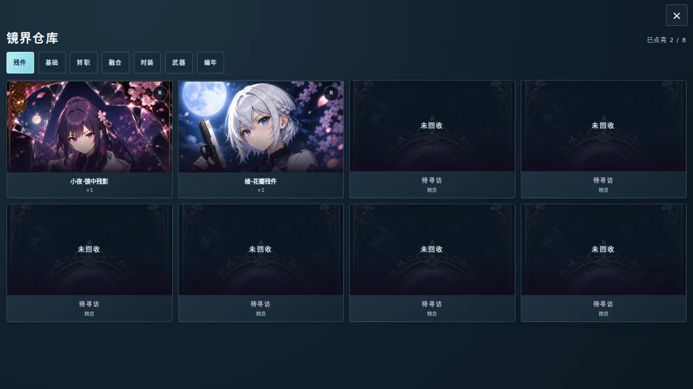
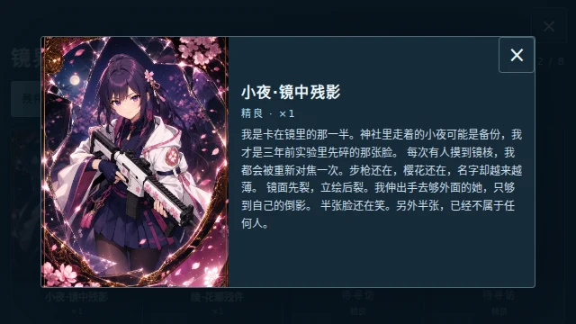
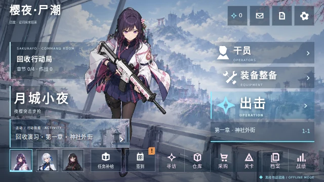

# 存档与界面重构验收

2026-10-05，Asia/Shanghai。基线 `851a6ad8e2016e2a76495fb34d1ff79521160441`，继续更新 PR #32，版本仍为 4.6.0 开发预发布。

## 实际改动

存档默认值、深层拷贝、设置和进度校验抽为 `sakurayo-save.js`，启动与文本导入共用；移除 index 中重复 merge/白名单、主神与商店默认值以及旧导入包装。过滤非法战绩条目，将旧字符串章号转为数字并去重。导入后重算可访问章节/主神阶级，重绘角色、应用画质/音量与界面设置。有效累计余额和战绩不再被旧导入任意上限截断；道具等级与主神阶级沿用游戏限制。

抽屉生命周期集中到 `sakurayo-ui.js`，删除两处 open/close 包装；command 面板使用稳定容器上的单一委托点击。根路由保留原入口焦点，仓库详情使用嵌套生命周期；关闭、Escape、Tab 与动态教程沿同一流程。剧情、升级、抉择、暂停和结算保持更高优先级。观察器仅处理抽屉相关变化，战斗 HUD 的 class 变化不触发抽屉扫描。

仓库增加内部滚动容器，编年史使用全宽，卡片详情在短横屏采用两列、提供 40px 关闭按钮，正文点击不关闭；样式保持节点和顺序，采购不会因进入寻访退回旧配色。统一仓库冷灰冰蓝外观，补 640×360 大厅及短屏寻访布局。整备提示对应实际 Shift 冲刺、空格主动技能。关卡按钮与活动入口共用待出击模式更新函数，大厅简报即时同步。

## 验证

环境：Linux、Playwright 1.62.1、Chromium Headless Shell 151.0.7922.34；使用真实 file URL。完整命令为 `bash tools/verify.sh`，退出 0，`VERIFY PASS`。

| 检查 | 结果 |
| --- | --- |
| 源码与离线静态/语法、全部单位测试、内容包与美术完整性 | 通过 |
| 纯存档边界：旧进度、坏战绩、默认设置、收据、危险键、合法大余额 | 10/10 |
| 真实旧档启动/导入/拒绝/重载、币数/收据、角色/设置恢复、章节锁 | 源码和离线通过 |
| 五房键盘导航、入口焦点、面板替换、嵌套详情与五类高优先弹窗 | 源码和离线通过 |
| 样式节点稳定、三视口六页仓库滚到末项、详情关闭、短屏三寻访池 | 源码和离线通过 |
| 大厅可见、40px 触控目标和中心点击 | 1280×720、932×430、844×390、740×360、640×360、430×932 通过 |
| 三角色、升级、四章 Boss、死亡重开、主神及无外部请求 | 源码和离线各 52 项 |
| 手机触控流程 / 界面和碰撞预算扫描 | 37 项 / P0=0、P1=0 |
| 官方扩展和 Mod Kit 隔离 | 源码和离线各 8 项 |

新增失败回归均先复现再修复。独立复审实际点击验证：低进度导入后只启动第一章；锁定主神会恢复普通模式；未确认主神关卡的出击仍进入选择页面。复审发现抉择层 ID 遗漏与累计余额截断，已补用例并修复，复查未留下重要发现。PowerShell 验证流程已同步；本轮实际执行的是 Bash。

## 实际画面

Android 单 HTML SHA-256：`739eef62ff1e398c9e632c7aeb716a8ae2bf1b5e56d25024cbe07eac3e23a163`。

本轮未发布 APK，未修改版本号或原战斗 update；寻访翻牌沿用现有实现。实际 Android 设备性能仍需实体机验收。
