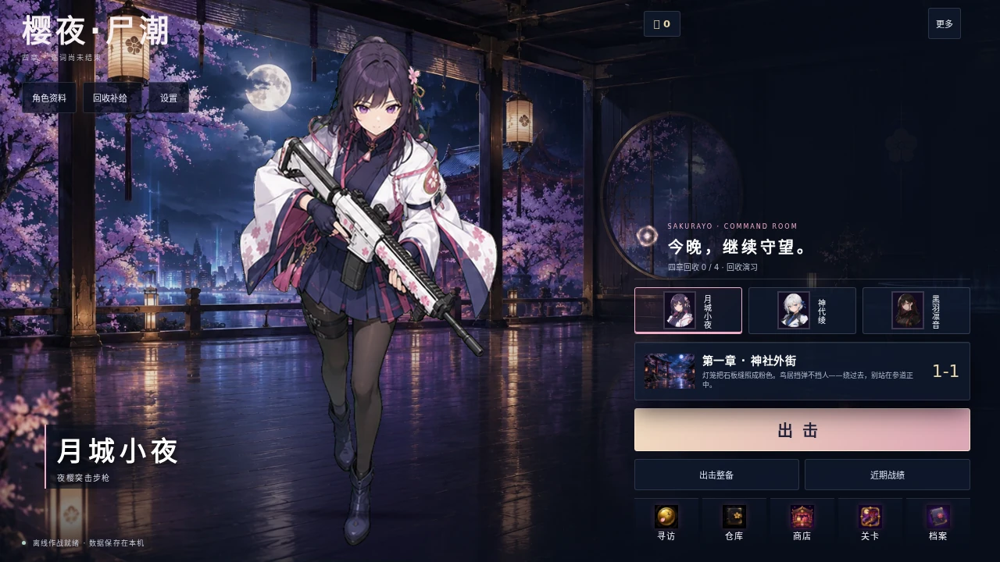
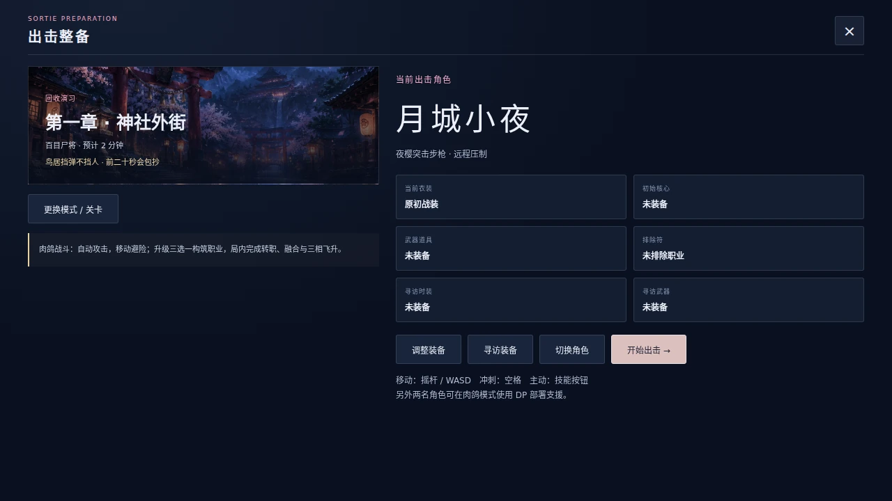
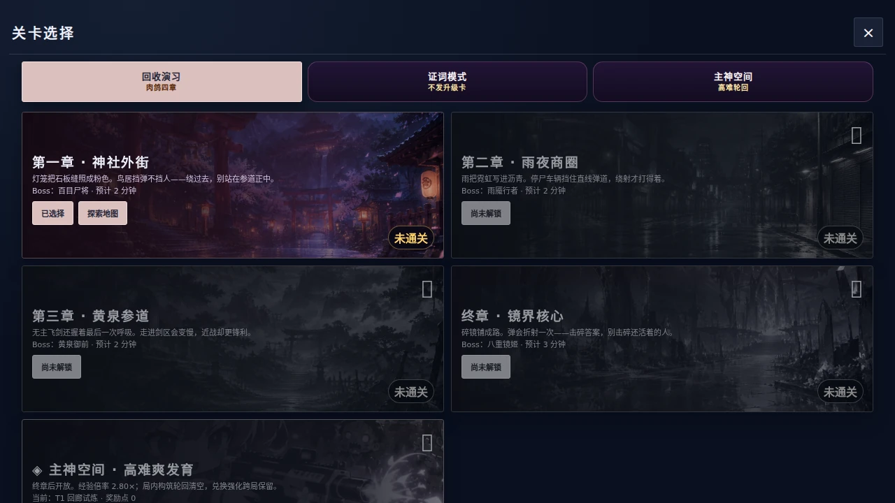
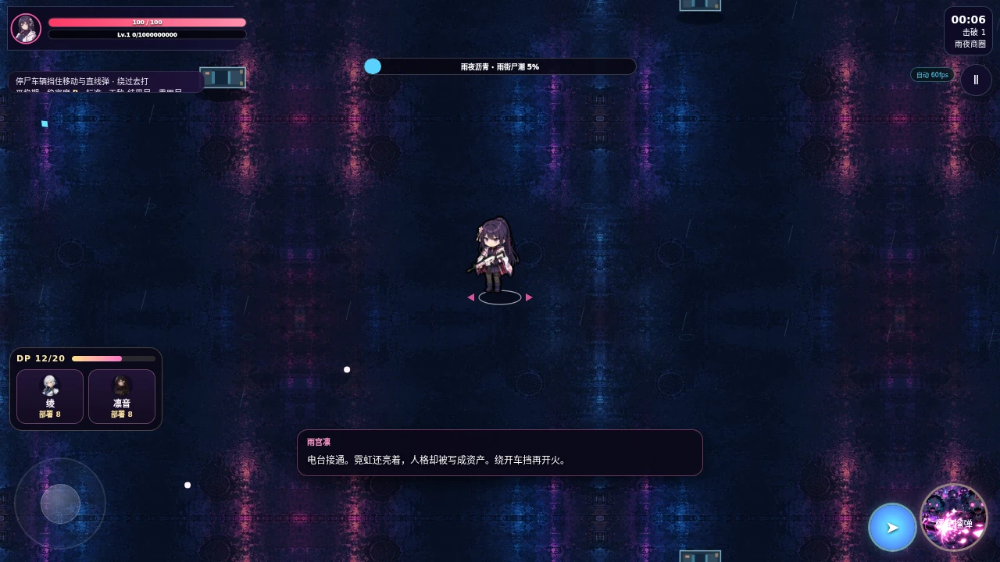

# 指挥大厅与四章精装修验收

2026-10-05（Asia/Shanghai）。基线 `93edb70d3ccef1073c80341c3d8df641055bb037`，版本仍为 4.6.0 开发预发布。

## 可试玩内容

打开 `android-app/app/src/main/assets/index.html`；同目录 `game/art` 必须保留。入口已内联全部运行时与内容包，没有 CDN 或字体下载。开发入口为 `src/index.html`。本次继续保留原肉鸽构筑、三角色、四章、Boss 阶段、主神空间和本地存档。

大厅提供角色资料、真实装备整备、近期战绩、六项一次性里程碑补给和原五导航房间。寻访时装/武器与旧装备均展示，记录重载后不重复发币。旧历史缺角色/时长时显示未记载；新证词与主神记录写入实际模式、角色和时长。

美术：十张生成原图，十五个本地 WebP（含四章场景插画、战场原画、可平铺地面及八帧指挥印记）。请求模型为指定中转的 `gpt-image-2.5`，终章地面重试使用 `gpt-image-2.5-flare`；这些是请求的模型标识。提示词在 `assets/image2/prompts/`，尺寸/帧数/哈希见 `assets/image2/command_renovation_manifest.json`。密钥未进入游戏或仓库。

## 实际验证

验证环境：Linux、Playwright 1.62.1、Chromium Headless Shell 151.0.7922.34，本地 file URL。

| 检查 | 结果 |
| --- | --- |
| 静态符号与全部运行时语法、八组单元测试 | 通过 |
| 新大厅：四种尺寸点击、40px 新按钮、三角色、焦点、装备、领取重载、战绩、整备出击、五房间 | 源码及离线入口通过 |
| 新美术全部解码，八帧动画与减少动态效果静帧 | 15 个 WebP 通过，合计 3,239,014 bytes |
| 四章环境动画、暂停确定性、低画质/长局数量上限、障碍裁剪与碰撞、六位置轨迹、地面纹理缓存 | 通过 |
| 现有扩展系统与旧档迁移 | 源码及离线入口各 8 项通过 |
| 完整游戏冒烟：三角色、升级、四章 Boss、死亡重开、主神与离线请求 | 源码及离线入口各 52 项通过 |
| 手机触控流程模拟 | 37 项通过 |
| 界面扫描 | P0=0、P1=0 |
| 寻访与现有房间实际截图 | 通过，无损坏图片 |
| 整分支独立代码审查 | 重要发现均修复，最终无 Critical/Important 未解决项 |

执行：`bash tools/verify.sh`，末尾 `VERIFY PASS`。脚本重新构建 Android 离线入口后再次跑单入口回归。

## 实际画面

## 构建边界

本次同步的是 Android 壳使用的离线 HTML 和资源，尚未构建/签名新 APK，未做安卓实体机性能测试。测试模式中的 60fps HUD 不能替代设备测量。没有修改玩家仓、发布正式版本或覆盖玩家存档。

Android 离线入口 SHA-256：`6d71e571c7e499e5f1cd38a6cdcefbafd30e3a7cbe46e63ba02041a11b613e48`。
