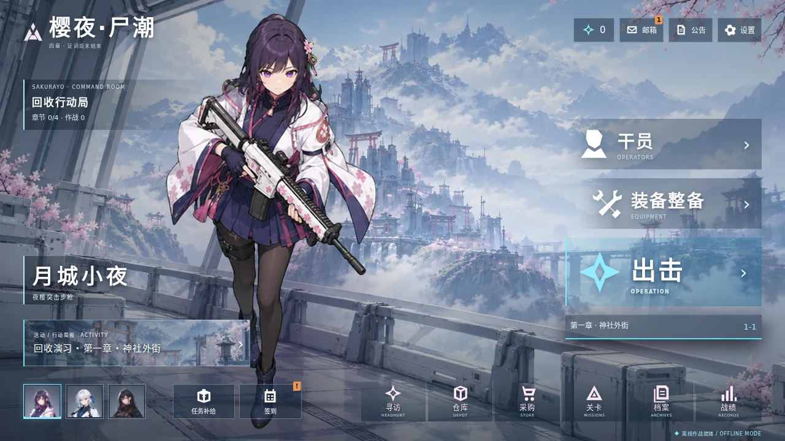
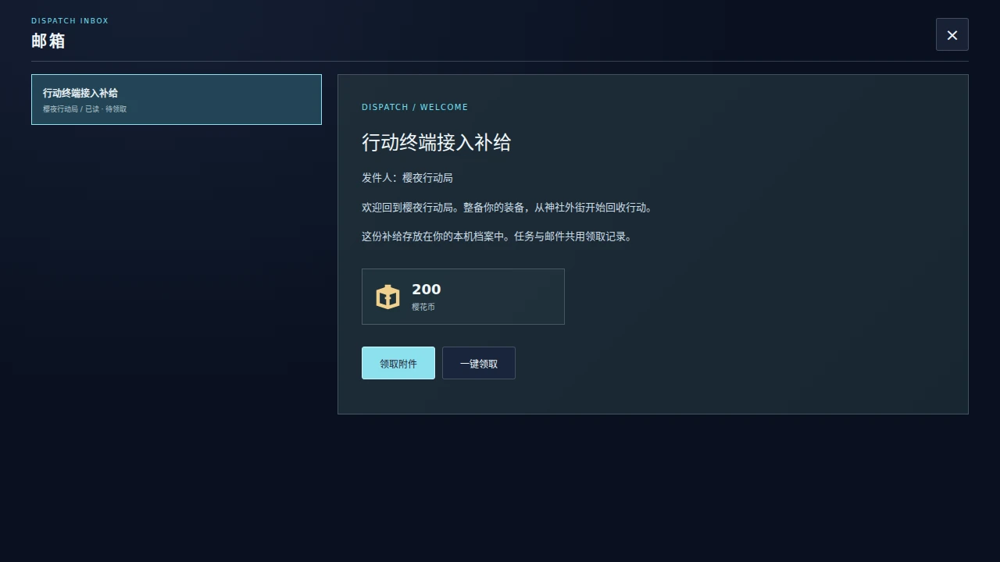
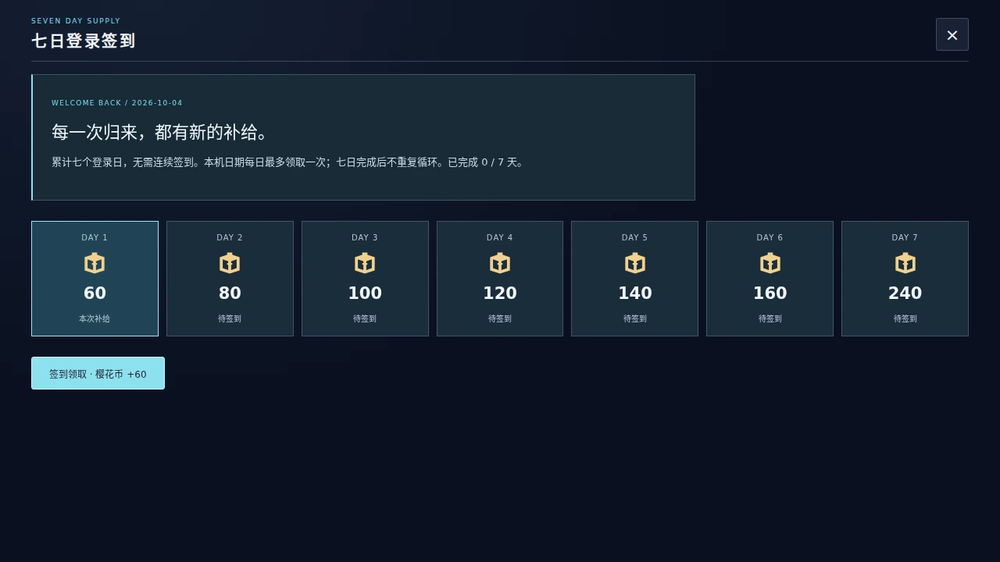
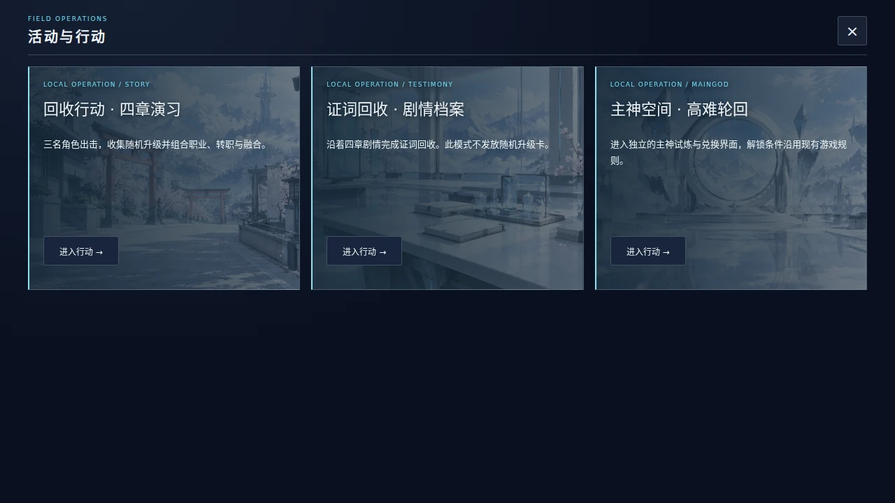
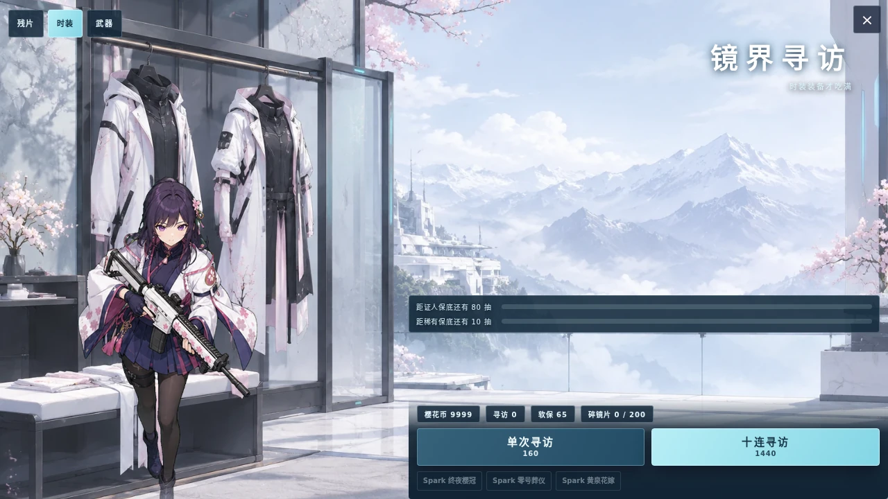

# 疏朗横屏大厅、服务与统一美术验收

2026-10-05（Asia/Shanghai）。本轮基于 `084d8cae3f0fba69f3362c9d7b83490db61cae6c`，继续更新 PR #32；版本仍为 4.6.0 开发预发布。上一轮四章与环境动画验收见 [原记录](VALIDATION_COMMAND_LOBBY.md)。

## 实际内容

以概念图确认的疏朗构图落地：左侧大立绘，右侧干员/装备整备/出击三个主入口，顶部资源/邮箱/公告/设置，底部六个小图标；左下提供活动、三角色切换、任务和签到。原寻访、仓库、采购、关卡、档案、装备及战绩均连接真实功能。设置补回新手说明、战斗统计、存档管理及扩展包管理。

邮箱有一封 200 币欢迎邮件，以及已达成里程碑的补给邮件。已读、附件与一键领取实际保存；任务和邮件共享收据，不能双领。签到按本机日期累计七天，无需连续，奖励为 60/80/100/120/140/160/240，完成后不循环。同日重领、日期回拨、非法日期和七次上限均有检查。存档继续使用 `sakurayoV3`，补齐新字段时保留旧币数、寻访保底、所有权及原里程碑记录。

十张新生产 WebP 全部由指定 LitangKing 中转站生成：三名角色头像、三套寻访场景、三张活动插画和大厅背景，共 2,067,734 bytes。成功请求模型别名为 `gpt-image-2.5`，主神插画使用同族 `gpt-image-2.5-flare`；中转未披露底层部署版本。最初布局概念由内置图像工具生成，其部署版本不可见。精确提示词和请求历史见 `assets/image2/prompts/tactical-*`，生产尺寸/哈希见两份 `tactical_*_manifest.json`。生成原图留在忽略的 source 目录；游戏只加载本地压缩素材。

奖励计算与存档归一化移至 services 模块；大厅布局、SVG 和素材装配移至 terminal 模块。新布局以 root class 和高优先级选择器隔离旧样式，打开房间重新注入旧 CSS 后保持稳定。修复实际币数计数器、保存档启动时标题创建顺序、底栏 span 旧样式覆盖，以及公告转活动后关闭焦点恢复。

## 本轮验证

环境：Linux、Playwright 1.62.1、Chromium Headless Shell 151.0.7922.34，实际 file URL。执行 `bash tools/verify.sh`，退出码 0，末尾 `VERIFY PASS`；重建离线入口后同套浏览器回归再次运行。

| 检查 | 本轮结果 |
| --- | --- |
| 源码与离线静态符号、全部 runtime 语法、九组单位测试、内容包检查 | 通过 |
| 新素材存在、WebP 解码、10 项完整性、尺寸、字节数和 SHA256 | 10 项通过 |
| 上一轮四章素材与八帧动画 | 15 个 WebP 全部通过 |
| 新大厅、各房间打开/关闭、三角色、40px 点击区域、遮挡与焦点 | 源码及离线入口通过 |
| 1280×720 / 932×430 / 844×390 / 740×360 / 430×932 | 五尺寸入口可见且中心可点击 |
| 邮件和签到领取/禁用/重载、存档导出、三种活动真实路由、旧档迁移 | 源码及离线入口通过 |
| DP 支援、证词关闭、宠物槽不受影响 | 通过 |
| 官方扩展、Mod Kit、保存迁移与非法扩展隔离 | 源码及离线入口各 8 项通过 |
| 三角色、升级、四章 Boss、死亡重开、主神和运行时离线请求 | 源码及离线入口各 52 项通过 |
| 手机触控流程模拟 | 37 项通过 |
| 界面/碰撞预算扫描 | P0=0，P1=0 |
| 寻访三池、活动三列、邮箱、七日卡及最终大厅视觉复查 | 实际截图通过，无脚本异常 |

验证日志在本地 `tests/artifacts/tactical-full-verify.log`；GitHub Actions 上传完整 tests/artifacts 作为运行证据。Bash 是本轮实际执行入口；PowerShell 流程已同步并经代码检查，此 Linux 环境未执行 PowerShell。

最终独立审查发现旧工具栏隐藏导致存档入口缺失，已补入设置。新回归先复现缺入口（RED），修复后真实打开和导出邮箱/签到/币数（GREEN）；独立审查另验证设置重绘、导出、下载、合法导入和关闭均通过，常规工具入口全部补齐。无未解决的重要发现。

## 实际画面

寻访截图使用测试档币数，仅为展示可用按钮；正式模式不提供测试后门。图库与概念图不等同于安装包。

## 试玩与边界

直接打开 `android-app/app/src/main/assets/index.html`，并保留同目录 `game/art`。运行时与六份内容包均内联，无 CDN、外部字体或 API 密钥。仍保留原肉鸽构筑、三角色、四章、职业/转职/融合/飞升、Boss 和主神空间，上一轮的环境动画和性能预算继续通过回归。

本轮没有构建或签名新 APK，没有安卓实体机性能测量，没有发布正式版本、改玩家仓或清空玩家存档。邮箱与签到是可用的本机服务，没有联网账号系统。

Android 离线入口 SHA-256：`d36ebaae7c2d5b253651f162ed746e9563abb8b7ae9ec81a6d342a5d33459626`。
